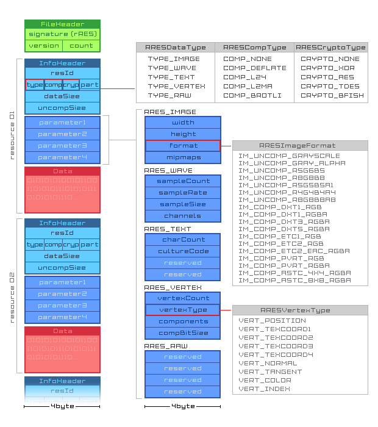
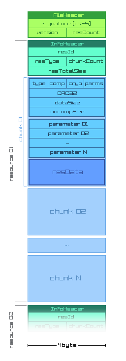

### WARNING: `rres` and `rrem` are still under development, they are not ready yet... hopefully soon...

 

**rres is a simple and easy-to-use resource packaging file-format**

rres has been designed to package game assets data into a simple self-contained comprehensive format, easy to read and write, prepared to load data in a fast and efficient way.

rres is inspired by [XNB](http://xbox.create.msdn.com/en-US/sample/xnb_format) file-format (used by XNA/MonoGame), [RIFF](https://en.wikipedia.org/wiki/Resource_Interchange_File_Format), [PNG](https://en.wikipedia.org/wiki/Portable_Network_Graphics) and [ZIP](https://en.wikipedia.org/wiki/Zip_(file_format)) file-formats.

 
 

## rres format design

First design of the format was limited to packaging one resource after another, every resource consisted of one `InfoHeader` followed by a fixed set of four possible parameters and the resource data. Along the .rres file, a .h header file was also generated to map the `resId` with a resource name (usually the original filename of the un-processed data). This model was pretty simple and intuitive but it has some important downsides, like not considering complex pieces of data that could require multiple chunks.

Second design was way more complex and tried to address first design shortcomings. In this design every resource could consist of multiple chunks of separate data, clearly defined by a set of properties and parameters. Actually, that design is more aligned with RIFF file-format and how most file types are structure, we could understand every resource in the package as a separate file on its own; also, this new design improves packaging possibilities and features.

## Tools

rREM was a preliminary implementation of a tool to support rres file generation from multiple assets data.

## License

rRES file-format is licensed under MIT license. Check [LICENSE](LICENSE) for further details.

*Copyright (c) 2014-2020 Ramon Santamaria ([@raysan5](https://twitter.com/raysan5))*
